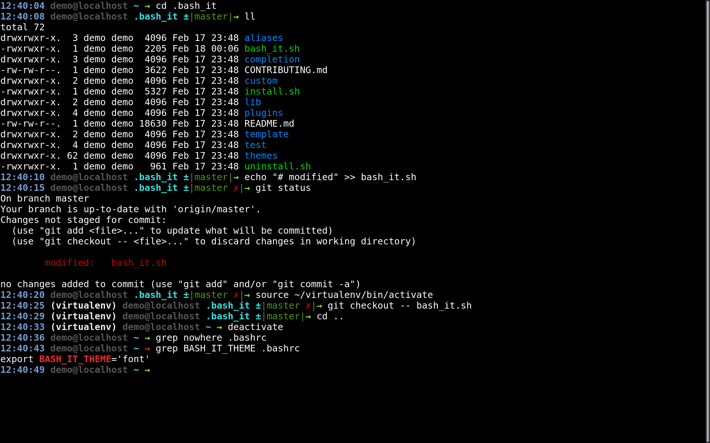

# font theme

## Description

The font theme is designed to be one-line, fast, and detailed in a concise way. It provides the following configurable options:

* time
* Python virtual environment
* user
* host
* path
* git repo
* git branch
* git dirty/not dirty
* return code status of last command

## Screenshot

Here it is in action:

